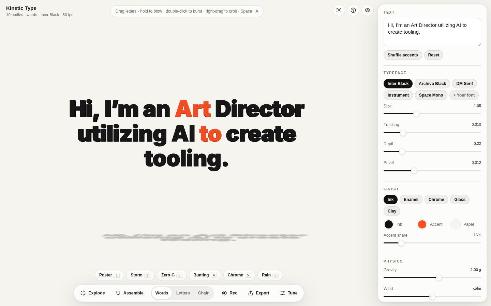
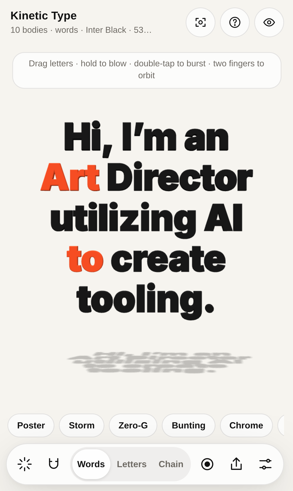
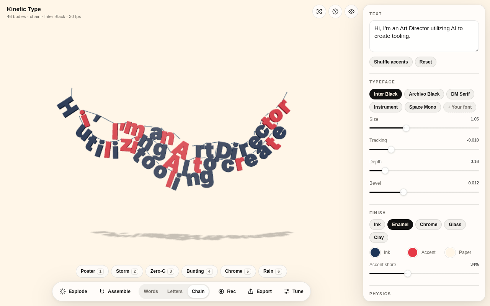
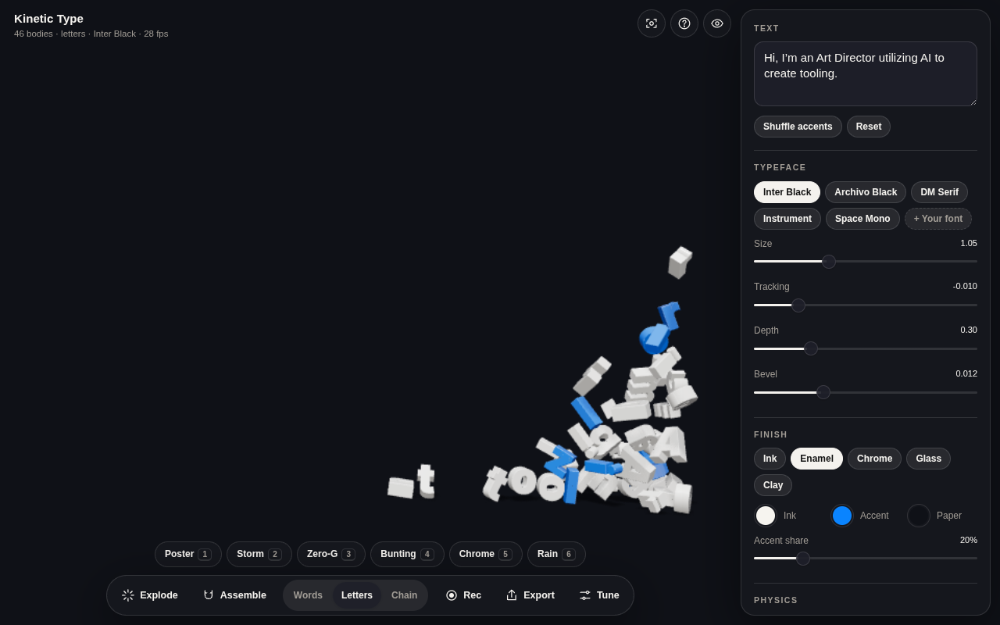

# Kinetic Type

**Set type, then throw it.** A 3D physics typography instrument for the browser — built for iPhone, iPad and desktop.

Every letter is a solid extruded from the font's real outlines, with collisions that follow its silhouette (an **O** has a hole in it, an **L** is actually L-shaped). Compose a line, knock it down, blow it around with your finger, tilt your phone to pour it into a corner, then pull it back together and export it as a poster, a vector file, a 3D model, an AR object or a video.

<p>
  
  
</p>
<p>
  
  
</p>

> v2 is a ground-up rebuild of the 2024 p5.js + Matter.js prototype. The original is kept at [`/v1/`](public/v1/index.html).

## What it does

| | |
| --- | --- |
| **Type** | Real OpenType outlines (opentype.js) → extruded, bevelled meshes with creased normals. GPOS kerning, including the extension lookups opentype.js skips. Five bundled faces, or drop in any TTF / OTF / WOFF. |
| **Physics** | Rapier (WASM). Each glyph is rasterised and greedy-meshed into a handful of cuboids, so bodies stack, hook and nest like their shapes. Words, Letters, or **Chain** (letters strung on rope joints). Hang, Flat (2.5D poster plane), Floor, wind with gusts, bounce, friction. |
| **Hands** | Grab and throw with any number of fingers. Hold empty space to fan. Double-tap for a shockwave. Two fingers orbit and pinch. **Assemble** flies every piece back into its typeset position; **Release** drops it again. |
| **iPhone** | **Tilt** makes gravity follow the phone (real down, even when you orbit); **shake** explodes. Bottom-sheet controls at a medium detent so the type stays visible. Safe areas, 44 pt targets, no zoom-on-focus, home-screen install. |
| **Look** | Ink, Enamel, Chrome, Glass and Clay finishes lit by a procedural studio environment with soft shadows. Print finishes render without tone mapping so a front-facing letter shows its exact hex. |
| **Export** | PNG at 2× (optionally transparent, shadows kept) · **SVG** of the projected glyph outlines, editable in Illustrator · **GLB** for Blender / C4D / Spline · **View in AR** (USDZ Quick Look on iOS) · **video** (MP4 on Safari, WebM elsewhere) · share links that rebuild the whole composition. On phones, exports open the share sheet. |
| **Scenes** | Poster, Storm, Zero-G, Bunting, Chrome, Rain (keys 1–6). |

### Controls

| Touch | Mouse / keys |
| --- | --- |
| Drag a letter — grab & throw | Drag — grab · hold empty space — fan |
| Hold empty space — fan | Right- or ⇧-drag — orbit · wheel — zoom |
| Double-tap — shockwave | Double-click — shockwave |
| Two fingers — orbit & pinch | `Space` explode · `A` assemble/release · `R` reset · `C` view |
| Tilt / shake (with Tilt on) | `M` mode · `F` flat · `1–6` scenes · `P` PNG · `V` record · `H` hide UI · `?` help |

## Run it

```bash
npm install
npm run dev        # http://localhost:5173  (add --host to try it on your phone)
npm test           # outline, kerning, layout, settings and tilt math
npm run build      # typecheck + static build in dist/
```

Add `?quality=low` or `?quality=high` to override the automatic quality tier. Tilt needs HTTPS on iOS (GitHub Pages is fine; for a LAN test use `vite --host` behind an HTTPS tunnel).

## How it's built

```
src/
  main.ts              boot + WebGL capability check
  app.ts               settings → type → bodies → pixels; input & actions
  settings.ts          the whole composition as one validated object, presets, share links
  type/
    fonts.ts           font registry, glyph cache, metrics
    gpos.ts            binary GPOS pair-kerning reader (TTF/OTF/WOFF, extension lookups)
    outline.ts         outlines → THREE.Shape (holes by winding) and → physics boxes
    layout.ts          line breaking, kerning/tracking, optical centring, fit-to-room
  physics/sim.ts       Rapier world: compound glyph bodies, ropes, wind, fan, grab, assemble
  render/
    stage.ts           renderer, camera rig, studio environment, shadows, dynamic resolution
    geometry.ts        extruded glyph geometry cache
    materials.ts       the five finishes
  input/
    gestures.ts        one pointer model for mouse, pen and touch
    tilt.ts            device orientation → gravity (with the math unit-tested)
  export/exporters.ts  PNG, SVG, GLB, USDZ, video, share sheet
  audio/impacts.ts     synthesised collision sounds per finish
  ui/ui.ts             data-attribute bindings for the controls in index.html
```

A few decisions worth knowing:

- **Glyph colliders.** Convex hulls make an L behave like a triangle. Glyphs are instead sampled on a ~0.07 em grid with the nonzero rule and merged into rectangles (4–5 boxes per glyph on average, rarely more than 9), which keeps counters open and concave shapes concave at negligible cost.
- **The room avoids the interface.** The canvas is full-screen, but a camera view offset fits the physics room to the area not covered by the panel, dock or sheet, so type never lands under a control.
- **Fixed-step physics** at 120 Hz (60 Hz on the low tier), independent of display refresh; dynamic resolution steps the pixel ratio down under load and is frozen while recording.
- **Rapier loads as its own chunk** (~840 kB gzipped) in parallel with the fonts and renderer.

## Deploy

Pushing to `main` runs `.github/workflows/static.yml`: tests, build, and publish `dist/` to GitHub Pages (**Settings → Pages → Source: GitHub Actions**). See [DEPLOY.md](DEPLOY.md) for the Squarespace embed.
